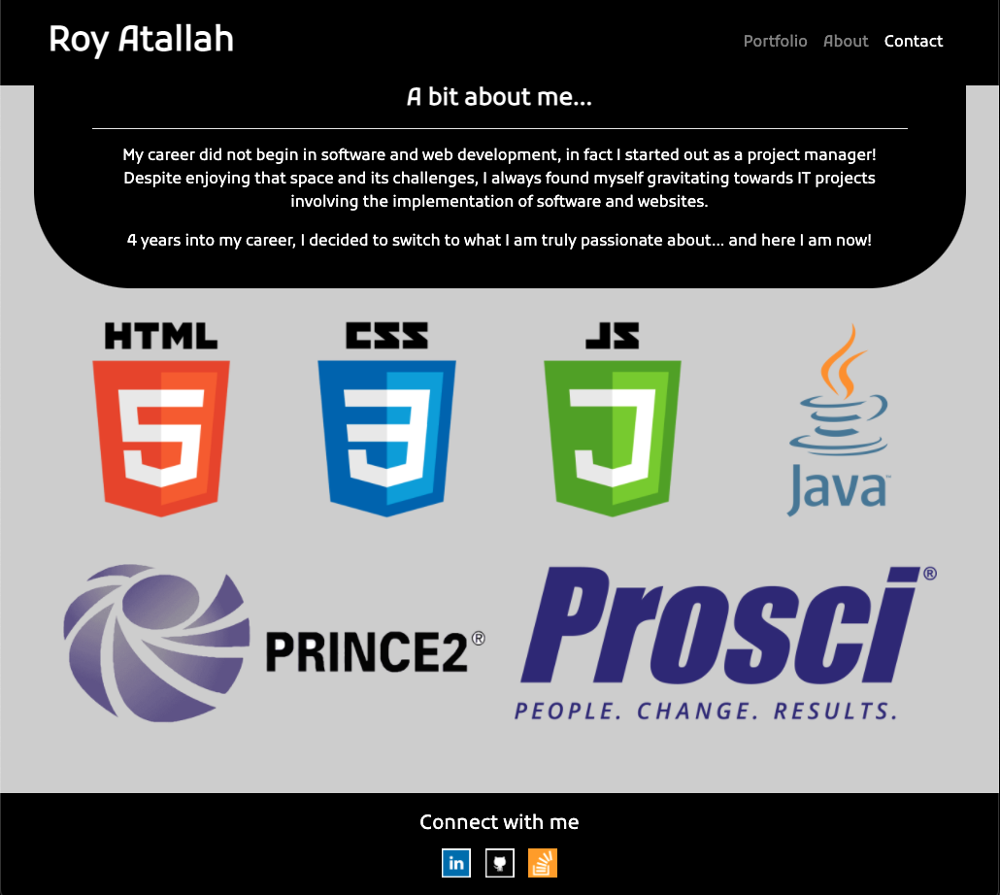

# Portfolio

Link: https://r-a-exe.github.io/portfolio/

## High-Level Description:

This is my professional portfolio website, built using Bootstrap for styling.
It consists of three pages (Home/About me, Portfolio, Contact).

## Pages

### Home/About me

This page usess index.html, and a combination of style.css and the bootstrap stylesheet. If contains an overview about myself.

### Portfolio

Based on portfolio.html as well as style.css and bootstrap, the page will list my projects as I complete them.

### Contact

Based on contact.html, this page contains a non-functional contact form that I will complete once I know how.

## Navigation

The nav bar and the footer are consistent accross pages. The header is responsive, and switches to a toggle button when the viewport chrinks below 540px. The footer, created using Bootstrap sticky footer guidelines (https://getbootstrap.com/docs/4.0/examples/sticky-footer/) adapts to the page in order to always be at the bottom of the viewport.